# Objective 

The objective of the shell script is to automate the setup and management of cloud resources across different environments—local, testing, and production. It provisions environment-specific AWS EC2 instances, creates and tags S3 buckets, and sets up IAM users with administrative permissions. The script dynamically adapts configurations such as instance types, AMI IDs, regions, and key pairs based on the specified environment, ensuring a streamlined, consistent, and secure infrastructure deployment process.

## Downloading and Configuring AWS CLI on the EC2 instance
The first step was to launch an EC2 instance as a root user, this is our default environment. After creating an instance on our AWS console as the root user , We SSH into the instance, downloaded and installed AWS CLI on the EC2 instance termial. 

 We are able to fetch and download AWS CLI version 2 data in an executable ZIP format using the following commands

    curl "https://awscli.amazonaws.com/awscli-exe-linux-x86_64.zip" -o "awscliv2.zip"

We can unzip the installer using 

    unzip awscliv2.zip

We can run the installer

    sudo ./aws/install
 

## Setting up Secure authentication to AWS API 

This step is crucial as it allows us to have the necessary aws account setup resource management. 
By setting up `AWS PROFILE` for all 3 environments (local, testing and production environments), we are able to send request and establish a connection 
with our AWS working environmet, thus enabling the AWS CLI have access to our user account
Our shell script code will check and pick up `AWS PROFILE` configuration for all 3 working environments

### Creating AWS_Profile for all 3 working environments, configuring .aws credentials and config files 
We manually created three IAM users in AWS console, enabled console access for each, and generated access key credentials for all three working environments. Administrator access policies were attached to each user.

#### Working environments:

- admin - local 
- admin - testing 
- admin - production 

**Note: for this project, all 3 working environments have policies that are administrative privileges which implies that they can access resources like the root user. If we want an environment to have specific responsibilty / duties then we can assign specific permissions and policies to each environment** 

The next step was configuring the **.aws** files. The **.aws** directory is a hidden folder in the home directory that stores configuration files and credentials for the AWS Command Line Interface (CLI). 
This directory typically contains two important files:

- config: This file holds configuration settings such as default region and output format.

- credentials: This file stores AWS access keys, which are used to authenticate your requests to AWS services.

We inputted the security credentials we had generated previously for the environments as seen below.

#### To set up an `AWS_Profile`:
- First, we need to navigate to the `.aws` directory

- Then we can reconfigure the 2 files in this directory (config and credentials) using the VIM text editor to edit the contents of the files 

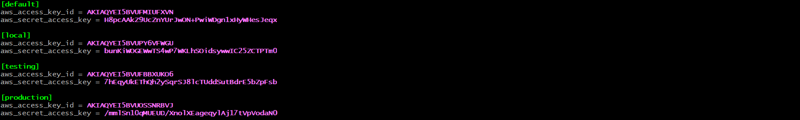

The .aws files allow us to manage your AWS resources from the command line without having to repeatedly enter our credentials. Therefore, whenever the shell script is executed for an environment, it automatically picks up the security credentials and configuration for that particular environment. 

As seen above we have edited and replaced access_keys and secret_access key for each environments. The default environment is the root user account  

The same is done for the `.aws/config` file. Here, all 3 environments are in the same region and uses the same ouput

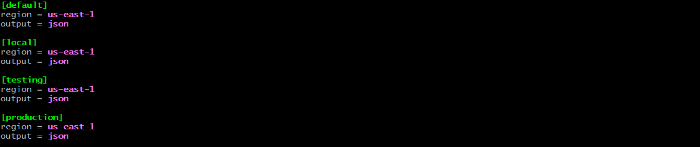

*Note: if we distribute our environment in 3 different regions other than the same region; we faciliate the reliablilty of our servers in case one region experiences an outage*  

With secure authentication set up for local, testing, and production environments, the next step is to create a bash shell script (`aws_cloud_manager.sh`) in our default root user account. Our shell script uses environmental variables that selects the appropriate configuration and authenticates us to either the local or testing or production environment."

## Function to check the number of arguments for environmental variable 

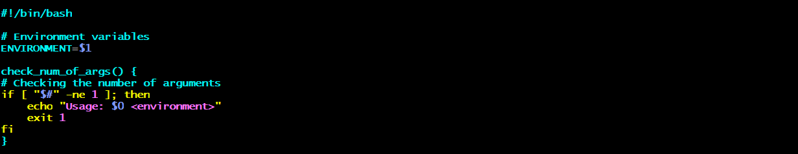

The script begins with a Shebang indicating the this script should be executed using the Bash shell

This next line on the script defines a function named `check_num_of_args` that checks the number of arguments passed to the script. The function uses the condition `if [ "$#" -ne 1 ]; then ... fi` to verify if the number of arguments is not equal to 1. If the condition is met, it executes the `echo` command to print the message "Usage: $0 <environment>", indicating the correct usage of the script. The script then exits with an error code 1 using `exit 1`, signaling that the expected number of arguments was not provided. This function ensures that the script is run with the appropriate number of arguments (in this case, just 1 argument ) to avoid errors during execution.

## Function to activate infrastructure environment

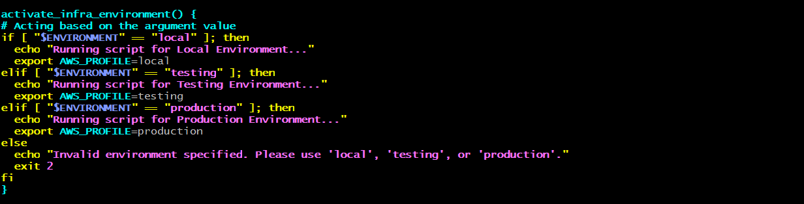

The part of the script defines a function named `activate_infra_environment` that configures the AWS environment based on the specified argument value. The function first checks if the ENVIRONMENT variable is set to "local" using `if [ "$ENVIRONMENT" == "local" ]; then ... fi`. If it is, it prints a message "Running script for Local Environment..." and sets the AWS profile to "local" using `export AWS_PROFILE=local`.

If the `ENVIRONMENT` variable is set to "testing", the script prints "Running script for Testing Environment..." and sets the AWS profile to "testing" using `export AWS_PROFILE=testing`. Similarly, if the `ENVIRONMENT` variable is set to "production", it prints "Running script for Production Environment..." and sets the AWS profile to "production" using `export AWS_PROFILE=production`.

If the `ENVIRONMENT` variable is not set to one of the expected values ("local", "testing", or "production"), the script prints an error message "Invalid environment specified. Please use 'local', 'testing', or 'production'." and exits with an error code `2` using `exit 2`.

This script helps ensure that the appropriate AWS environment is activated based on the provided argument, facilitating environment-specific configurations.

*Note: the `exit` command is terminates the entire script,, makes sure the script stops running, and no further commands are executed.*

## Function to check if AWS CLI is installed 

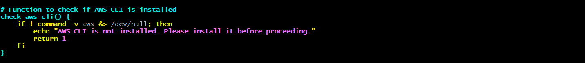

This part of the script defines a function named `check_aws_cli` which checks whether the AWS CLI is installed on the system. It uses the condition `if ! command -v aws &> /dev/null;` `then ... fi` to determine if the `aws` command is available

`the command -v aws`: checks for the presence of the aws command, which is the AWS CLI. it redirects any output to /dev/null, which effectively discards any output on the CLI 

`if ! ...`: the ! operator negates the condition, so if `command -v aws` does not find the command, it executes the echo command to print the message "AWS CLI is not installed. Please install it before proceeding" and returns an error code `1` using `return 1`. This ensures that the script does not proceed without the necessary AWS CLI tool installed.

## Function to check if the AWS-PROFILE is set 

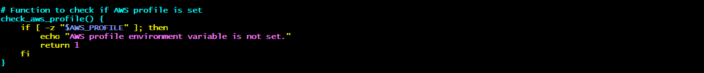

This part of the script defines a function named check_aws_profile which checks whether the AWS profile environment variable is set. The function uses the condition `if [ -z "$AWS_PROFILE" ]; then ... fi` to determine if the AWS_PROFILE environment variable is empty. If the variable is not set, it executes the `echo` command to print the message "AWS profile environment variable is not set" and returns an error code `1` using `return 1`. This script helps ensure that the AWS profile is properly configured before executing any AWS CLI commands.

## Function to create IAM users and assign them to the 'admin' group
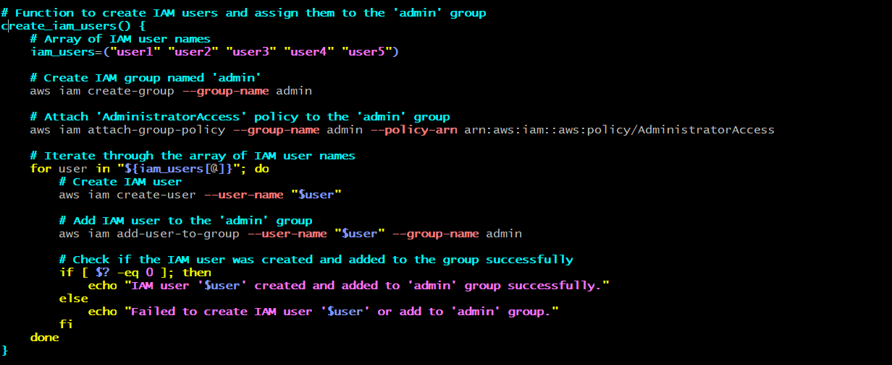

The part of the script begins with defining a function `create_iam_users` which encompasses the entire operation of managing `IAM users` and the group. It first declares an array iam_users containing 5 IAM user names: `("user1" "user2" "user3" "user4" "user5")`.

Next, the part of the code uses the command `aws iam create-group --group-name admin` to create an IAM group named 'admin'. It then attaches the 'AdministratorAccess' policy to this group with the command `aws iam attach-group-policy --group-name admin --policy-arn arn:aws:iam::aws:policy/AdministratorAccess`.

The script then iterates over each user name in the `iam_users` array using a `for` loop within which it creates an IAM user in the environment for which the shell script is executed for.
 
`aws iam create-user --user-name "${user}-${ENVIRONMENT}`. After creating each user, it adds the user to the 'admin' group with the command `aws iam add-user-to-group --user-name "${user}-${ENVIRONMENT}" --group-name admin`

**Note: all users in this group now have administrative access, meaning they are able to access all resources like a root user. To update/change access, we can remodify the administratoraccess policy or attach a new policy to the admin group**

Lastly, the script checks if the previous command is executed successfully by examining the exit status using `if [ $? -eq 0 ]; then ... else ... fi`, providing feedback messages for successful or failed operations. 

This effectively automates the creation of IAM users, group assignment, and policy attachment using AWS CLI commands, ensuring efficient IAM management.

*Below is an example of IAM users created when the shell script is executed for the testing environment*

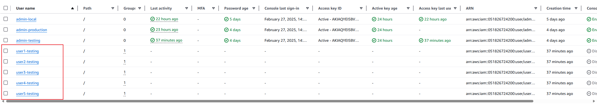

## Function to create EC2 instances and to check if instances were created successfully
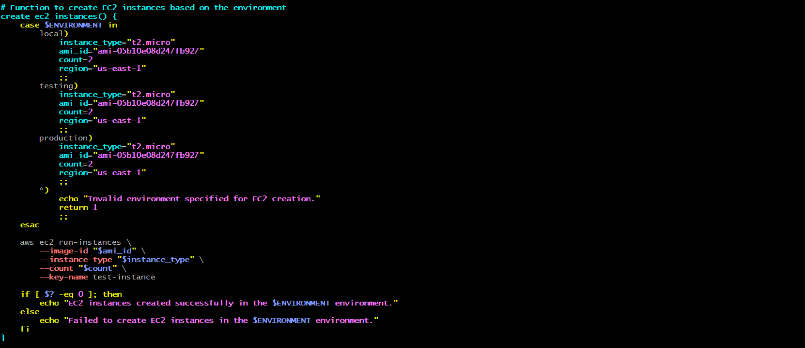

This section of the script includes a function called `create_ec2_instances`, which defines parameters. A case statement is used to set the parameters — instance_type, ami_id, count, and region — based on the chosen environment (local, testing, or production).

 We have manually created 3 EC2 instances on the root user account, one for each environment with Amazon Linux AMI-ID `ami-05b10e08d247fb927`. The Key pair to access these instances is the same as the root user (test-instance.pem) and region is set to `us-east-1` matching .aws configuration file

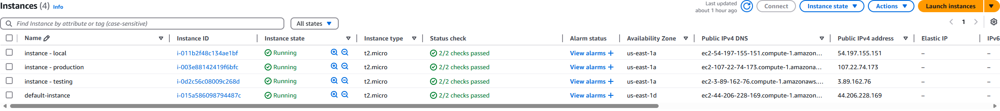

**Note: the region set in `.aws/config` directory should match the regions of the EC2 instance so as 
to avoid errors and misconfigurations**

 All the instances type are `t2-micro`. The number of instances to create with the specific AMI-ID is 2 as specified in the case statement `count=2`

The script then automates the process of creating EC2 instances using AWS CLI command `aws ec2 run-instances --image-id "$ami_id" --instance-type "$instance_type" --count $count --key-name "${ENVIRONMENT}-test-instance`. As we have specified in the case statements; it creates 2 additional EC2 instances based on our specified parameters 

Following this, it checks if the instances were created successfully using `if [ $? -eq 0 ]; then ... else ... fi`, the conditional statement `if [ $? -eq 0 ]` checks the exit status of the last executed command, then it provides feedback messages indicating whether the EC2 instances were created successfully or if the creation failed. If the exit status is 0, it prints out "EC2 instances created successfully" ,otherwise if the exit status is not 0, it indicates an error and print outs "failed to create EC2 instance. 

 

## Function to create S3 buckets for different departments
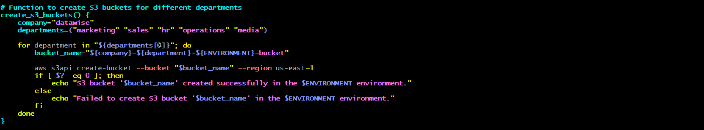

The part of the script defines a function named `create_s3_buckets` which is designed to create S3 buckets for different departments within a company using AWS CLI commands. The function begins by defining a company name prefix, company="datawise", and an array of department names, `departments=("marketing" "sales" "hr" "operations" "media")`.

The script then uses a `for` loop to iterate through the array of department names. Within the loop, it constructs the bucket name for each department by combining the company name prefix, the department name and in which environment, resulting in a unique bucket name like `datawise-marketing-production-bucket`.

*Note: S3 bucket names follows the specific rules for bucket naming, and is unique acress all exsting bucket nmes in Amazon S3. otherwise the resulting output will be an invalid bucket name*

 The command `aws s3api create-bucket --bucket "$bucket_name" --region your-region` is used to create the S3 bucket for each department in the specified region.

After attempting to create each bucket, the script checks the exit status of the `create-bucket` command using `if [ $? -eq 0 ]; then ... else ... fi`. If the command was successful, it prints a success message indicating the S3 bucket was created successfully. Otherwise, it prints a failure message indicating that the bucket creation failed.

This script effectively automates the creation of S3 buckets for multiple departments, ensuring that each department has its dedicated storage space in the AWS S3 service.

*Note: When the shell script is executed for a specific environment. Each bucket would have a tag (with their name) that indicates the environment it corresponds to. Here is an example of the shell script that is executed for the testing environment*
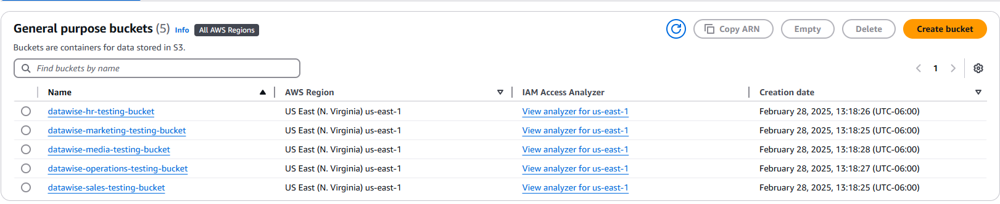

## Call functions 

Our script ends with defining the main executions flow call of our functions in a desired order. This ensures that the script is well-organized, and maintains a logical flow, and all necessary steps are performed in the correct sequence. 

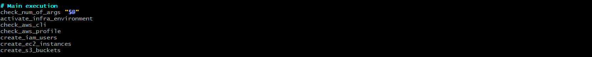

## Full Shell Script Code

            #!/bin/bash

            # Environment variable
            ENVIRONMENT=$1

            Function to check the number of arguments
            check_num_of_args() {
                if [ "$#" -ne 1 ]; then
                    echo "Usage: $0 <environment>"
                    exit 1
                fi
            }

            # Function to activate the infrastructure environment
            activate_infra_environment() {
                if [ "$ENVIRONMENT" == "local" ]; then
                    echo "Running script for Local Environment..."
                    export AWS_PROFILE=local
                elif [ "$ENVIRONMENT" == "testing" ]; then
                    echo "Running script for Testing Environment..."
                    export AWS_PROFILE=testing
                elif [ "$ENVIRONMENT" == "production" ]; then
                    echo "Running script for Production Environment..."
                    export AWS_PROFILE=production
                else
                    echo "Invalid environment specified. Please use 'local', 'testing', or 'production'."
                    exit 2
                fi
            }

            # Function to check if AWS CLI is installed
            check_aws_cli() {
                if ! command -v aws &> /dev/null; then
                    echo "AWS CLI is not installed. Please install it before proceeding."
                    exit 1
                fi
            }

            # Function to check if AWS profile is set
            check_aws_profile() {
                if [ -z "$AWS_PROFILE" ]; then
                    echo "AWS profile environment variable is not set."
                    exit 1
                fi
            }

            # Function to create IAM users and attach them to the 'admin' group with administrative access
            create_iam_users() {
                # Array of IAM user names
                iam_users=("user1" "user2" "user3" "user4" "user5")

                # Create IAM group named 'admin'
                aws iam create-group --group-name admin

                # Attach 'AdministratorAccess' policy to the 'admin' group
                aws iam attach-group-policy --group-name admin --policy-arn arn:aws:iam::aws:policy/AdministratorAccess

                # Iterate through the array of IAM user names
                for user in "${iam_users[@]}"; do
                    # Create IAM user
                    aws iam create-user --user-name "${user}-${ENVIRONMENT}"

                    # Add IAM user to the 'admin' group
                    aws iam add-user-to-group --user-name "${user}-${ENVIRONMENT}" --group-name admin

                    # Check if the IAM user was created and added to the group successfully
                    if [ $? -eq 0 ]; then
                        echo "IAM user '${user}-${ENVIRONMENT}' created and added to 'admin' group successfully."
                    else
                        echo "Failed to create IAM user '${user}-${ENVIRONMENT}' or add to 'admin' group."
                    fi
                done
            }

                # Function to create EC2 instances based on the environment
                create_ec2_instances() {
                    case $ENVIRONMENT in
                        local)
                            instance_type="t2.micro"
                            ami_id="ami-05b10e08d247fb927"
                            count=2
                            region="us-east-1"
                            ;;
                        testing)
                            instance_type="t2.micro"
                            ami_id="ami-05b10e08d247fb927"
                            count=2
                            region="us-east-1"
                            ;;
                        production)
                            instance_type="t2.micro"
                            ami_id="ami-05b10e08d247fb927"
                            count=2
                            region="us-east-1"
                            ;;
                        *)
                            echo "Invalid environment specified for EC2 creation."
                            return 1
                            ;;
                    esac

                    aws ec2 run-instances \
                        --image-id "$ami_id" \
                        --instance-type "$instance_type" \
                        --count "$count" \
                        --key-name "${ENVIRONMENT}-test-instance"

                    if [ $? -eq 0 ]; then
                        echo "EC2 instances created successfully in the $ENVIRONMENT environment."
                    else
                        echo "Failed to create EC2 instances in the $ENVIRONMENT environment."
                    fi
                }

                # Function to create S3 buckets for different departments
                create_s3_buckets() {
                    company="datawise"
                    departments=("marketing" "sales" "hr" "operations" "media")

                    for department in "${departments[@]}"; do
                        bucket_name="${company}-${department}-${ENVIRONMENT}-bucket"

                        aws s3api create-bucket --bucket "$bucket_name" --region us-east-1
                        if [ $? -eq 0 ]; then
                            echo "S3 bucket '$bucket_name' created successfully in the $ENVIRONMENT environment."
                        else
                            echo "Failed to create S3 bucket '$bucket_name' in the $ENVIRONMENT environment."
                        fi
                    done
                }

                # Main execution
                check_num_of_args "$@"
                activate_infra_environment
                check_aws_cli
                check_aws_profile
                create_iam_users
                create_ec2_instances
                create_s3_buckets
